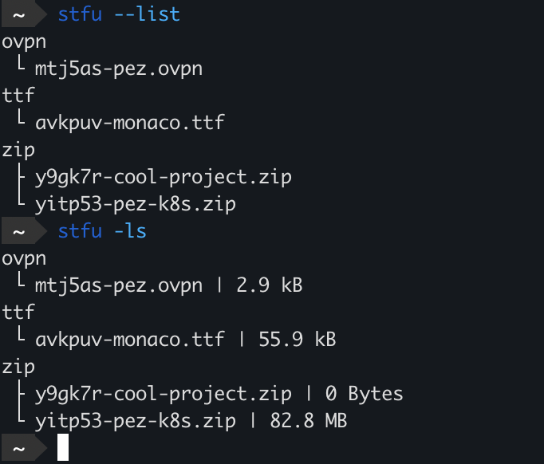

# STFU

_pronounced "stuff-oo"_


## What?
Simple Type-organized File Uploader

## Why?
STFU is created to allow for quick upload to GCS.

Any files that you want to easily stow away for future reference or to keep secure can be STFU'd to a bucket near you!

## When?
Any time is a good time to STFU.

## How?

### Prerequisite
A service account JSON file is required for authentication
To generate a file go to the below link:

https://console.cloud.google.com/iam-admin/serviceaccounts/create

### Building
``` bash
make
make install
```


### Examples

Let's say you have a file called "cool-project.zip" and you want this file to not get accidentally deleted.
With STFU it's now easier than ever to quickly upload it to GCP for future handling.
``` bash
stfu cool-project.zip
```
It's really that easy!
Now if you want to list which files you have stored you run with `--list`
``` bash
stfu --list

# zip
#  └ y9gk7r-cool-project.zip
```
STFU appends a random ID to every file so you can keep uploading files with the same name!
``` bash 
zip
 ├ 0rdg9u-cool-project.zip
 ├ ft0spo-cool-project.zip
 ├ oot699-cool-project.zip
 └ y9gk7r-cool-project.zip
```

Another example with more different filetypes


### Arguments
|Flag|Short|Description|
|---|---|---|
|`PATH`| |Glob style path-name of file to upload|
|`--init`| |Initializes `~/.stfurc` file with project name and bucket config|
|`--list`|`-l`|Lists files in storage|
|`--rm`|`-r`|Removes N amount of files by filename|
|`--download`|`-d`|Downloads N amount of files by filename|
|`--share`| |Create public link to N amount of files by filename|
|`--date`|`-c`|Shows date created when using `--list`|
|`--size`|`-s`|Shows file size when using `--list`|